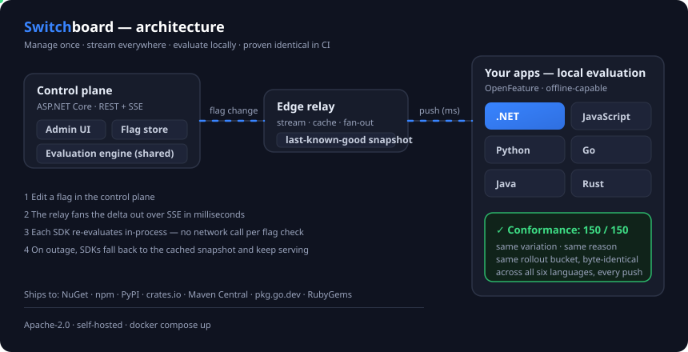
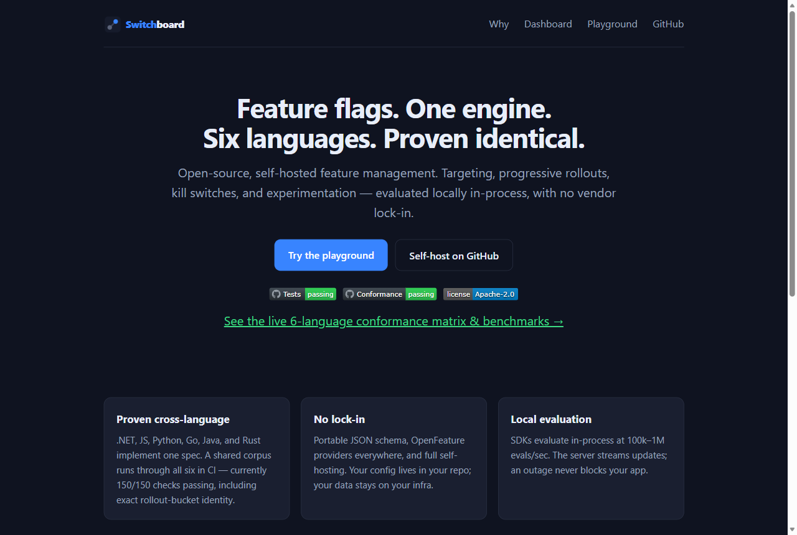
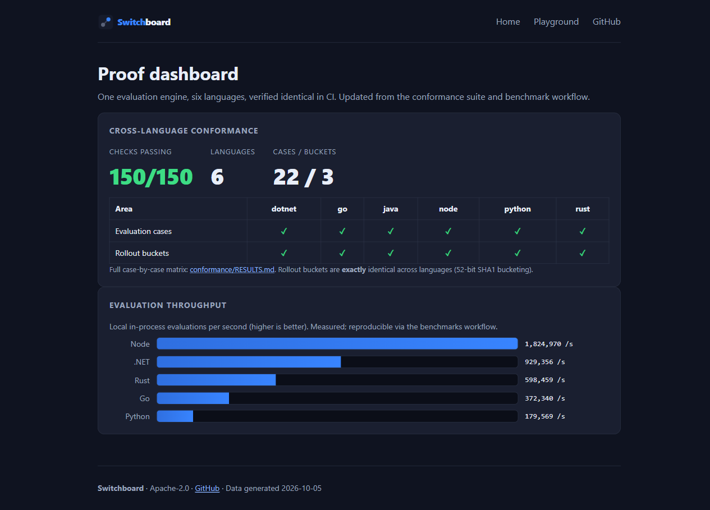
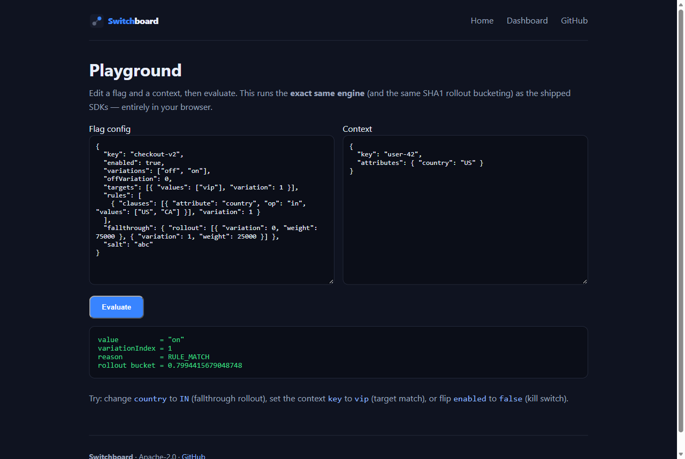
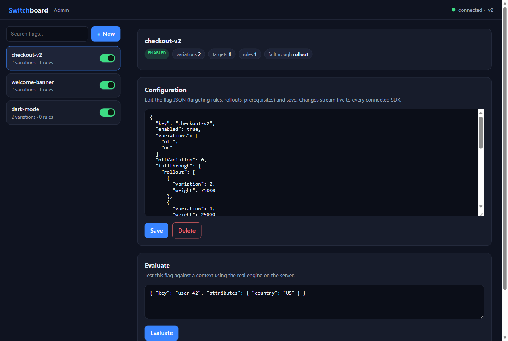

# Switchboard

**Open-source, self-hosted feature management with one identical evaluation engine in six languages — proven byte-for-byte in CI.**

[](https://github.com/switchboard-io/switchboard/actions/workflows/tests.yml)
[](https://github.com/switchboard-io/switchboard/blob/main/conformance/RESULTS.md)
[](LICENSE)
[](https://www.nuget.org/packages/Switchboard.Sdk)
[](https://www.npmjs.com/package/@switchboard/sdk)
[](https://pypi.org/project/switchboard-sdk/)
[](https://crates.io/crates/switchboard-sdk)

Feature flags, targeting, progressive rollouts, kill switches, and experimentation —
without vendor lock-in. Switchboard evaluates flags **locally, in-process** in every
SDK, so flag checks add no network latency and keep working even if the server is
unreachable.

<p align="center">
  
</p>

<p align="center">
  <a href="https://switchboard-io.github.io/switchboard/"></a>
  <a href="https://switchboard-io.github.io/switchboard/dashboard.html"></a>
</p>
<p align="center">
  <a href="https://switchboard-io.github.io/switchboard/playground.html"></a>
  
</p>
<p align="center"><sub>
  <b><a href="https://switchboard-io.github.io/switchboard/">Live site</a></b> ·
  <a href="https://switchboard-io.github.io/switchboard/dashboard.html">Proof dashboard</a> ·
  <a href="https://switchboard-io.github.io/switchboard/playground.html">Interactive playground</a> —
  the <b>Admin dashboard</b> (bottom-right) ships with the self-hosted server (<code>docker compose up</code>).
</sub></p>

---

## Why Switchboard

- **One engine, six languages, proven identical.** .NET, JavaScript, Python, Go, Java,
  and Rust implement the [same evaluation spec](docs/SPEC.md). A shared
  [conformance corpus](conformance/) runs through all of them on every push and
  publishes a [pass/fail matrix](conformance/RESULTS.md) — including **exact
  cross-language identity of rollout bucketing** (a user lands in the same percentage
  slice no matter which SDK your services use). Current status: **150/150 checks
  passing across 6 languages.**
- **No lock-in.** Portable JSON flag schema, [OpenFeature](https://openfeature.dev)
  providers for every language, and full self-hosting. Your config lives in your repo
  and your data stays on your infrastructure.
- **Local evaluation.** SDKs evaluate in-process using a deterministic engine; the
  server streams config updates. An outage never blocks your app.
- **Open core.** Apache-2.0. Run it yourself for free.

## Install

| Language | Install |
|----------|---------|
| .NET | `dotnet add package Switchboard.Sdk` |
| JavaScript | `npm install @switchboard/sdk` |
| Python | `pip install switchboard-sdk` |
| Go | `go get github.com/switchboard-io/switchboard-go` |
| Rust | `cargo add switchboard-sdk` |
| Java | `io.github.switchboard-io:sdk` (Maven) |

## Quickstart

```csharp
// .NET
using Switchboard;
using Switchboard.Evaluation;

var client = SwitchboardClient.FromJson(snapshotJson);
var ctx = new EvalContext("user-42").Set("country", JsonValue.Create("US"));
bool on = client.GetBool("checkout-v2", ctx, defaultValue: false);
```

```js
// JavaScript
import { SwitchboardClient } from "@switchboard/sdk";
const client = SwitchboardClient.fromJson(snapshot);
const on = client.getBool("checkout-v2", { key: "user-42", attributes: { country: "US" } });
```

```python
# Python
from switchboard_sdk import SwitchboardClient
client = SwitchboardClient.from_json(snapshot)
on = client.get_bool("checkout-v2", {"key": "user-42", "attributes": {"country": "US"}})
```

## Run the server (60-second local trial)

```bash
docker compose up --build
# open http://localhost:8080  — the Admin UI (create flags, evaluate, live updates)
```

The all-in-one server bundles the control plane, the evaluation engine, a REST +
Server-Sent-Events API, and an Admin UI. Try it:

```bash
curl localhost:8080/api/flags
curl -X POST localhost:8080/api/eval/welcome-banner -d '{"key":"u1","attributes":{"country":"US"}}'
```

## CLI

```bash
dotnet tool install -g Switchboard.Cli
switchboard eval checkout-v2 --config flags.json --context '{"key":"u1","attributes":{"country":"US"}}'
switchboard bucket checkout-v2 abc user-1     # deterministic rollout bucket
```

## Performance

Local evaluation runs at **>100k–1M evaluations/sec per core** depending on language —
see [docs/BENCHMARKS.md](docs/BENCHMARKS.md) for measured, CI-reproducible numbers.

## Repository layout

```
packages/<lang>/        real SDK + OpenFeature provider per language
packages/dotnet/        engine, SDK, provider, CLI, server, tests, bench
conformance/            shared corpus + per-language runners + RESULTS.md matrix
docs/                   SPEC, GUIDE, BENCHMARKS, design + go-to-market plans
web/                    landing page + interactive playground (GitHub Pages)
scripts/                version-sync + tooling
.github/workflows/      tests, conformance, benchmarks, pages, publish
```

## Documentation

- [Evaluation spec](docs/SPEC.md) — the contract every SDK implements.
- [Guide](docs/GUIDE.md) — concepts: flags, targeting, rollouts, prerequisites.
- [Migrate from LaunchDarkly](docs/MIGRATE-FROM-LAUNCHDARKLY.md) — concept mapping + step-by-step.
- [Conformance results](conformance/RESULTS.md) — the six-language parity matrix.
- [Benchmarks](docs/BENCHMARKS.md) — measured throughput per language.
- [Architecture & design](docs/Switchboard-Feature-Management-Design.md).
- [Go-to-market plan](docs/Switchboard-GTM-Delivery-Plan.md).

## License

[Apache-2.0](LICENSE). Contributions welcome — see [CONTRIBUTING.md](CONTRIBUTING.md).