# Switchboard — Feature Management Platform

**A self-hosted, open feature-flag & experimentation service built in .NET/C#.**

> Design goal: keep every strength of LaunchDarkly, and structurally convert each of its weaknesses (except cost, which is out of scope) into a competitive advantage. Ships with a CLI, REST + gRPC API, streaming, SDKs (OpenFeature), GraphQL, webhooks, and an Admin UI.

- **Status:** Design v1.0
- **Date:** 2026-08-05
- **Owner:** Parag
- **Language / runtime:** C# / .NET 8+ (LTS)

---

## Table of contents

1. [Objectives & principles](#1-objectives--principles)
2. [Converting cons into pros](#2-converting-cons-into-pros)
3. [Domain model & terminology](#3-domain-model--terminology)
4. [Component architecture](#4-component-architecture)
5. [Data model (ERD)](#5-data-model-erd)
6. [Evaluation engine](#6-evaluation-engine)
7. [Use cases & sequence diagrams](#7-use-cases--sequence-diagrams)
8. [State machines](#8-state-machines)
9. [Interfaces](#9-interfaces)
10. [Non-functional design](#10-non-functional-design)
11. [Deployment topology](#11-deployment-topology)
12. [Build phases / roadmap](#12-build-phases--roadmap)

---

## 1. Objectives & principles

| Principle | Meaning |
|-----------|---------|
| **Feature parity** | Real-time flags, advanced targeting, experimentation, governance, reliability, broad SDK support. |
| **Anti-lock-in by design** | OpenFeature-native, portable flag schema, full import/export, Terraform/GitOps. |
| **Progressive complexity** | "One toggle in 60 seconds" up to enterprise targeting — same product, layered UX. |
| **Flag-debt elimination** | Lifecycle management is a first-class feature, not an afterthought. |
| **No hard third-party dependency** | Self-hosted; SDKs evaluate locally and fall back to cache/offline; degrade gracefully. |
| **Multi-interface** | REST + gRPC API, streaming, CLI, SDKs, GraphQL, webhooks, Admin UI. |

---

## 2. Converting cons into pros

| LaunchDarkly con | Switchboard response (the new "pro") |
|------------------|--------------------------------|
| **Vendor lock-in** | Native **OpenFeature** provider model + **portable JSON/YAML flag schema**. `switchboard export`/`import` produces a full, version-controllable snapshot. First-class **Terraform provider** and **GitOps** (flags-as-code) so config lives in *your* repo. |
| **Complexity / overkill** | **Simple Mode vs Advanced Mode.** New flags default to boolean on/off with zero targeting; rules, segments, experiments are progressively revealed. Templates + scaffolding via CLI. |
| **Flag debt** | **Flag Lifecycle Engine**: `temporary/permanent` typing, TTL/expiry, staleness detection from live telemetry, **code-reference scanning**, "safe to archive" reports, automated archival with undo window. |
| **Third-party dependency in critical path** | **Self-hosted + Edge Relay.** SDKs cache last-known-good to memory/disk and support a **file/offline provider**. Evaluation is local, so an outage never blocks the app. |
| **Learning curve** | Batteries-included DX: interactive CLI, quick-start templates, inline docs, dry-run evaluation (`switchboard eval`), guided Admin UI. |

---

## 3. Domain model & terminology

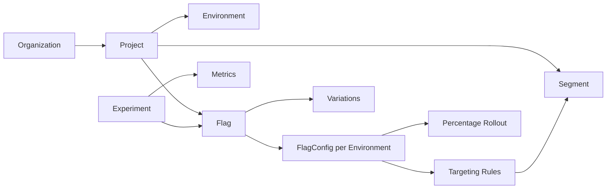
```mermaid
flowchart LR
    Org[Organization] --> Proj[Project]
    Proj --> Env[Environment]
    Proj --> Flag[Flag]
    Flag --> Cfg[FlagConfig per Environment]
    Cfg --> Rule[Targeting Rules]
    Cfg --> Roll[Percentage Rollout]
    Proj --> Seg[Segment]
    Rule --> Seg
    Flag --> Var[Variations]
    Exp[Experiment] --> Flag
    Exp --> Metric[Metrics]
```

- **Organization → Project → Environment** is the tenancy hierarchy.
- A **Flag** is defined once at project level; its behavior is configured **per Environment** via **FlagConfig** (so `dev` can be ON while `production` is OFF).
- **Segments** are reusable audience definitions referenced by rules.
- **Variations** are the possible return values (bool / string / number / JSON).

---

## 4. Component architecture

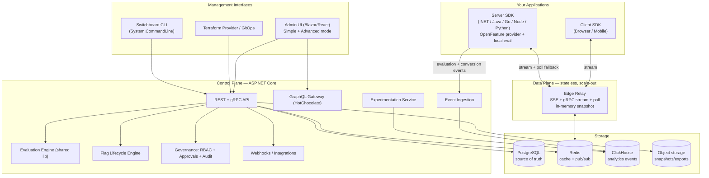
```mermaid
flowchart TB
    subgraph Clients["Your Applications"]
        SDKsrv["Server SDK\n(.NET / Java / Go / Node / Python)\nOpenFeature provider + local eval"]
        SDKcli["Client SDK\n(Browser / Mobile)"]
    end

    subgraph Interfaces["Management Interfaces"]
        CLI["Switchboard CLI\n(System.CommandLine)"]
        TF["Terraform Provider / GitOps"]
        UI["Admin UI (Blazor/React)\nSimple + Advanced mode"]
    end

    subgraph Edge["Data Plane — stateless, scale-out"]
        Relay["Edge Relay\nSSE + gRPC stream + poll\nin-memory snapshot"]
    end

    subgraph Core["Control Plane — ASP.NET Core"]
        API["REST + gRPC API"]
        GQL["GraphQL Gateway (HotChocolate)"]
        Eval["Evaluation Engine (shared lib)"]
        Life["Flag Lifecycle Engine"]
        Exp["Experimentation Service"]
        Gov["Governance: RBAC + Approvals + Audit"]
        Hooks["Webhooks / Integrations"]
        Ingest["Event Ingestion"]
    end

    subgraph Data["Storage"]
        PG[("PostgreSQL\nsource of truth")]
        Redis[("Redis\ncache + pub/sub")]
        CH[("ClickHouse\nanalytics events")]
        Blob[("Object storage\nsnapshots/exports")]
    end

    SDKsrv <-->|stream + poll fallback| Relay
    SDKcli <-->|stream| Relay
    SDKsrv -->|evaluation + conversion events| Ingest
    CLI --> API
    TF --> API
    UI --> GQL
    UI --> API
    Relay <--> Redis
    API --> PG
    API --> Redis
    API --> Eval
    API --> Life
    API --> Gov
    API --> Hooks
    Exp --> CH
    Ingest --> CH
    API --> Blob
```

**Layer split**

- **Control plane** — all writes, governance, config. Consistency-first, PostgreSQL-backed.
- **Data plane / Edge Relay** — reads + streaming only. Stateless, horizontally scalable, Redis fan-out, CDN-cacheable. Isolates blast radius from the control plane.
- **Evaluation engine** — one shared C# library (`Switchboard.Evaluation`) used **both** server-side and compiled into the .NET SDK, guaranteeing identical results everywhere.

---

## 5. Data model (ERD)

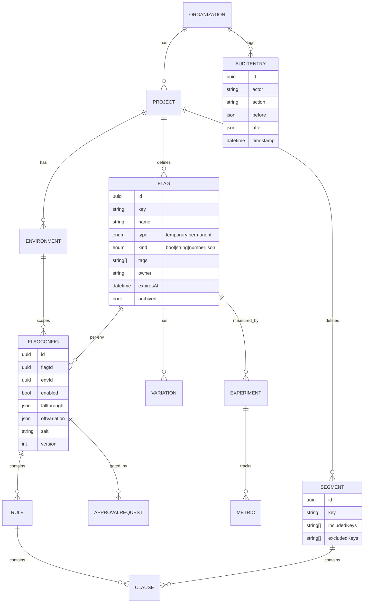
```mermaid
erDiagram
    ORGANIZATION ||--o{ PROJECT : has
    PROJECT ||--o{ ENVIRONMENT : has
    PROJECT ||--o{ FLAG : defines
    PROJECT ||--o{ SEGMENT : defines
    FLAG ||--o{ FLAGCONFIG : "per env"
    ENVIRONMENT ||--o{ FLAGCONFIG : scopes
    FLAGCONFIG ||--o{ RULE : contains
    RULE ||--o{ CLAUSE : contains
    SEGMENT ||--o{ CLAUSE : contains
    FLAG ||--o{ VARIATION : has
    FLAG ||--o{ EXPERIMENT : measured_by
    EXPERIMENT ||--o{ METRIC : tracks
    FLAGCONFIG ||--o{ APPROVALREQUEST : gated_by
    ORGANIZATION ||--o{ AUDITENTRY : logs

    FLAG {
        uuid id
        string key
        string name
        enum type "temporary|permanent"
        enum kind "bool|string|number|json"
        string[] tags
        string owner
        datetime expiresAt
        bool archived
    }
    FLAGCONFIG {
        uuid id
        uuid flagId
        uuid envId
        bool enabled
        json fallthrough
        json offVariation
        string salt
        int version
    }
    SEGMENT {
        uuid id
        string key
        string[] includedKeys
        string[] excludedKeys
    }
    AUDITENTRY {
        uuid id
        string actor
        string action
        json before
        json after
        datetime timestamp
    }
```

---

## 6. Evaluation engine

Pure, deterministic, side-effect-free. Given `(FlagConfig, EvaluationContext)` it returns `(value, variationIndex, reason)`.

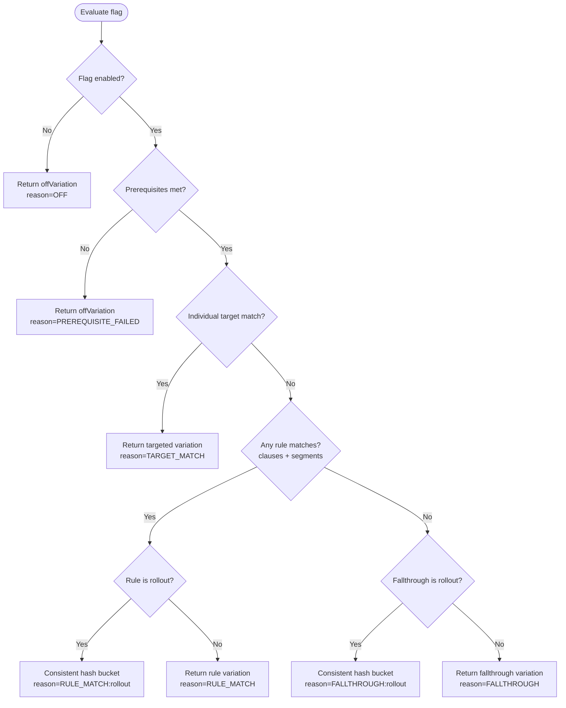
```mermaid
flowchart TD
    Start([Evaluate flag]) --> Enabled{Flag enabled?}
    Enabled -- No --> Off[Return offVariation\nreason=OFF]
    Enabled -- Yes --> Prereq{Prerequisites met?}
    Prereq -- No --> Off2[Return offVariation\nreason=PREREQUISITE_FAILED]
    Prereq -- Yes --> Target{Individual target match?}
    Target -- Yes --> TVal[Return targeted variation\nreason=TARGET_MATCH]
    Target -- No --> Rules{Any rule matches?\nclauses + segments}
    Rules -- Yes --> RRoll{Rule is rollout?}
    RRoll -- Yes --> Bucket[Consistent hash bucket\nreason=RULE_MATCH:rollout]
    RRoll -- No --> RVal[Return rule variation\nreason=RULE_MATCH]
    Rules -- No --> FRoll{Fallthrough is rollout?}
    FRoll -- Yes --> FBucket[Consistent hash bucket\nreason=FALLTHROUGH:rollout]
    FRoll -- No --> FVal[Return fallthrough variation\nreason=FALLTHROUGH]
```

**Bucketing:** `bucket = MurmurHash(context.key + ":" + flag.salt) / MAX` gives a stable value in `[0,1)`, so a user consistently lands in the same rollout slice as long as the salt is unchanged.

**Reasons returned:** `OFF`, `PREREQUISITE_FAILED`, `TARGET_MATCH`, `RULE_MATCH[:i]`, `FALLTHROUGH`, `ERROR` — surfaced to the SDK debugger and written to the audit/event stream.

---

## 7. Use cases & sequence diagrams

### 7.1 SDK bootstrap & initial flag load

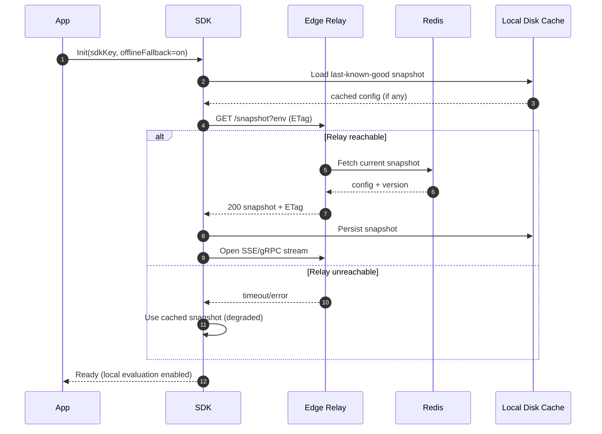
```mermaid
sequenceDiagram
    autonumber
    participant App
    participant SDK
    participant Relay as Edge Relay
    participant Redis
    participant Cache as Local Disk Cache

    App->>SDK: Init(sdkKey, offlineFallback=on)
    SDK->>Cache: Load last-known-good snapshot
    Cache-->>SDK: cached config (if any)
    SDK->>Relay: GET /snapshot?env (ETag)
    alt Relay reachable
        Relay->>Redis: Fetch current snapshot
        Redis-->>Relay: config + version
        Relay-->>SDK: 200 snapshot + ETag
        SDK->>Cache: Persist snapshot
        SDK->>Relay: Open SSE/gRPC stream
    else Relay unreachable
        Relay-->>SDK: timeout/error
        SDK->>SDK: Use cached snapshot (degraded)
    end
    SDK-->>App: Ready (local evaluation enabled)
```

### 7.2 Real-time flag change propagation

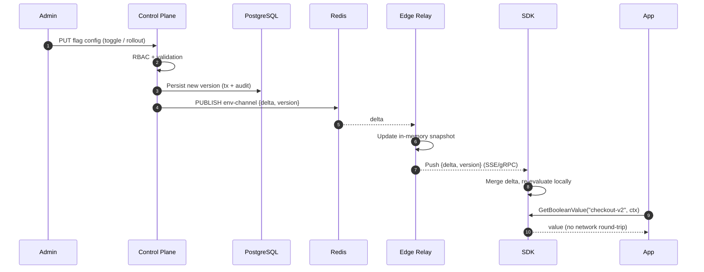
```mermaid
sequenceDiagram
    autonumber
    participant Admin
    participant API as Control Plane
    participant PG as PostgreSQL
    participant Redis
    participant Relay as Edge Relay
    participant SDK
    participant App

    Admin->>API: PUT flag config (toggle / rollout)
    API->>API: RBAC + validation
    API->>PG: Persist new version (tx + audit)
    API->>Redis: PUBLISH env-channel {delta, version}
    Redis-->>Relay: delta
    Relay->>Relay: Update in-memory snapshot
    Relay-->>SDK: Push {delta, version} (SSE/gRPC)
    SDK->>SDK: Merge delta, re-evaluate locally
    App->>SDK: GetBooleanValue("checkout-v2", ctx)
    SDK-->>App: value (no network round-trip)
```

### 7.3 Flag evaluation at runtime (local, no round-trip)

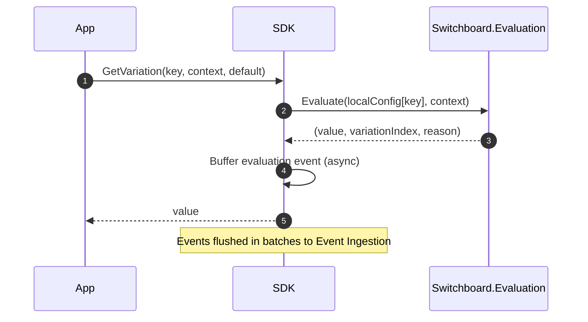
```mermaid
sequenceDiagram
    autonumber
    participant App
    participant SDK
    participant Engine as Switchboard.Evaluation

    App->>SDK: GetVariation(key, context, default)
    SDK->>Engine: Evaluate(localConfig[key], context)
    Engine-->>SDK: (value, variationIndex, reason)
    SDK->>SDK: Buffer evaluation event (async)
    SDK-->>App: value
    Note over SDK: Events flushed in batches to Event Ingestion
```

### 7.4 Percentage / progressive rollout

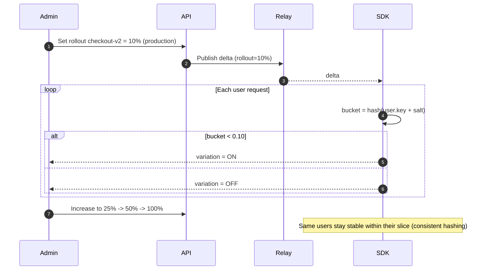
```mermaid
sequenceDiagram
    autonumber
    participant Admin
    participant API
    participant Relay
    participant SDK

    Admin->>API: Set rollout checkout-v2 = 10% (production)
    API->>Relay: Publish delta (rollout=10%)
    Relay-->>SDK: delta
    loop Each user request
        SDK->>SDK: bucket = hash(user.key + salt)
        alt bucket < 0.10
            SDK-->>Admin: variation = ON
        else
            SDK-->>Admin: variation = OFF
        end
    end
    Admin->>API: Increase to 25% -> 50% -> 100%
    Note over SDK: Same users stay stable within their slice (consistent hashing)
```

### 7.5 Targeting with segments

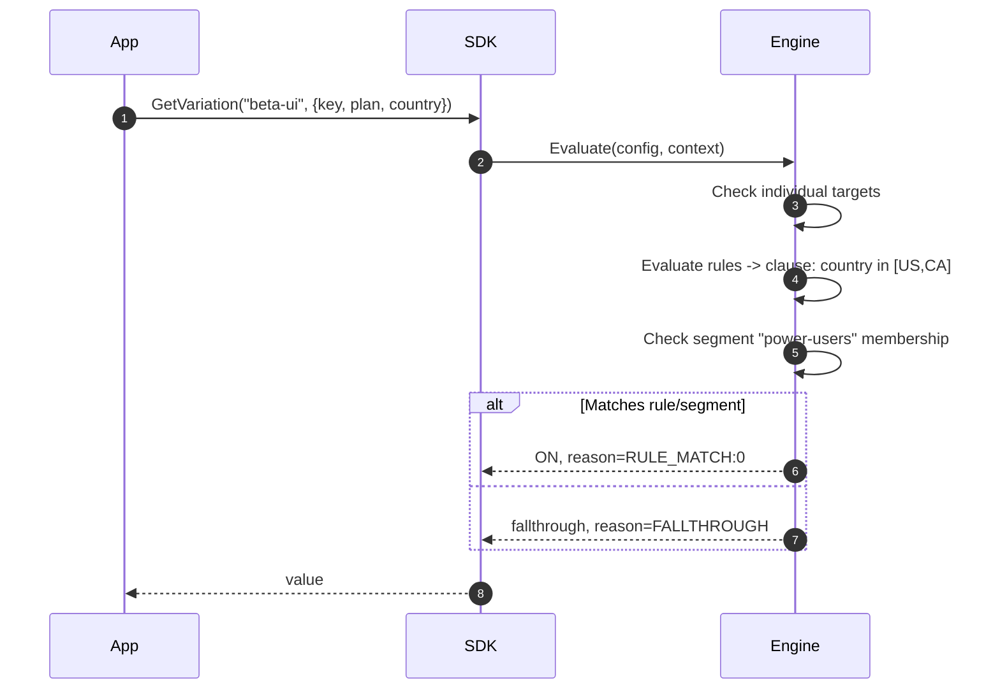
```mermaid
sequenceDiagram
    autonumber
    participant App
    participant SDK
    participant Engine

    App->>SDK: GetVariation("beta-ui", {key, plan, country})
    SDK->>Engine: Evaluate(config, context)
    Engine->>Engine: Check individual targets
    Engine->>Engine: Evaluate rules -> clause: country in [US,CA]
    Engine->>Engine: Check segment "power-users" membership
    alt Matches rule/segment
        Engine-->>SDK: ON, reason=RULE_MATCH:0
    else
        Engine-->>SDK: fallthrough, reason=FALLTHROUGH
    end
    SDK-->>App: value
```

### 7.6 Governance — change with approval workflow

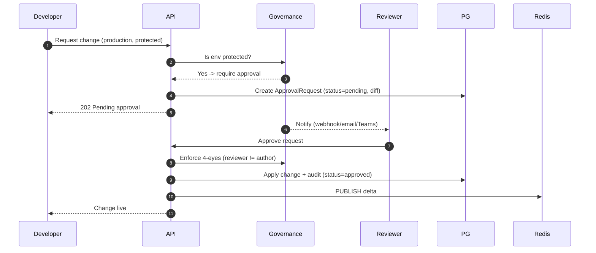
```mermaid
sequenceDiagram
    autonumber
    participant Dev as Developer
    participant API
    participant Gov as Governance
    participant Rev as Reviewer
    participant PG
    participant Redis

    Dev->>API: Request change (production, protected)
    API->>Gov: Is env protected?
    Gov-->>API: Yes -> require approval
    API->>PG: Create ApprovalRequest (status=pending, diff)
    API-->>Dev: 202 Pending approval
    Gov-->>Rev: Notify (webhook/email/Teams)
    Rev->>API: Approve request
    API->>Gov: Enforce 4-eyes (reviewer != author)
    API->>PG: Apply change + audit (status=approved)
    API->>Redis: PUBLISH delta
    API-->>Dev: Change live
```

### 7.7 Kill switch / emergency off

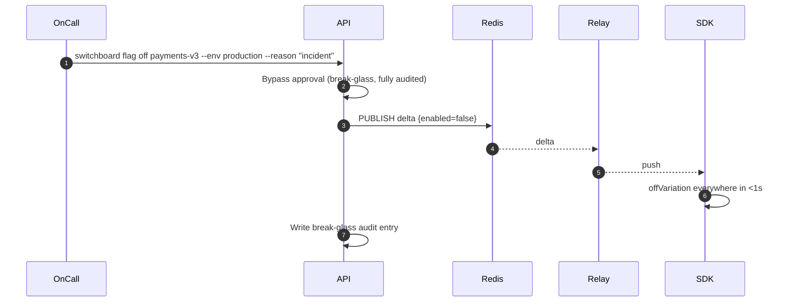
```mermaid
sequenceDiagram
    autonumber
    participant OnCall
    participant API
    participant Redis
    participant Relay
    participant SDK

    OnCall->>API: switchboard flag off payments-v3 --env production --reason "incident"
    API->>API: Bypass approval (break-glass, fully audited)
    API->>Redis: PUBLISH delta {enabled=false}
    Redis-->>Relay: delta
    Relay-->>SDK: push
    SDK->>SDK: offVariation everywhere in <1s
    API->>API: Write break-glass audit entry
```

### 7.8 Experimentation & metrics

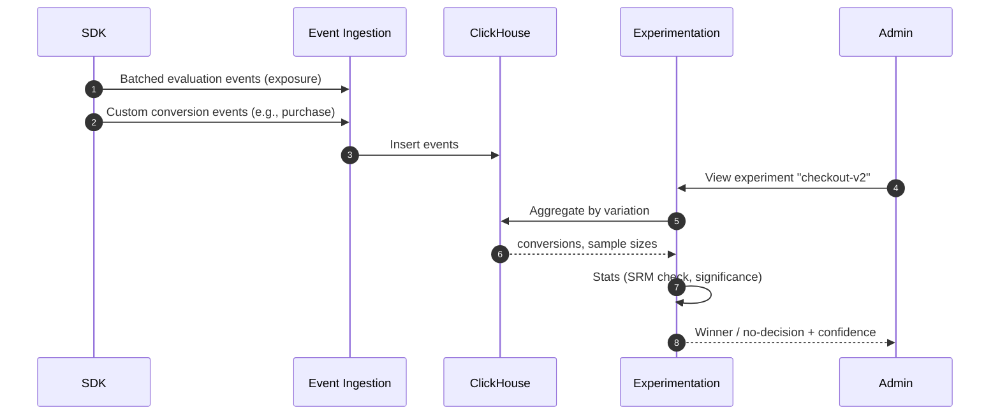
```mermaid
sequenceDiagram
    autonumber
    participant SDK
    participant Ingest as Event Ingestion
    participant CH as ClickHouse
    participant Exp as Experimentation
    participant Admin

    SDK->>Ingest: Batched evaluation events (exposure)
    SDK->>Ingest: Custom conversion events (e.g., purchase)
    Ingest->>CH: Insert events
    Admin->>Exp: View experiment "checkout-v2"
    Exp->>CH: Aggregate by variation
    CH-->>Exp: conversions, sample sizes
    Exp->>Exp: Stats (SRM check, significance)
    Exp-->>Admin: Winner / no-decision + confidence
```

### 7.9 Guarded rollout with auto-rollback

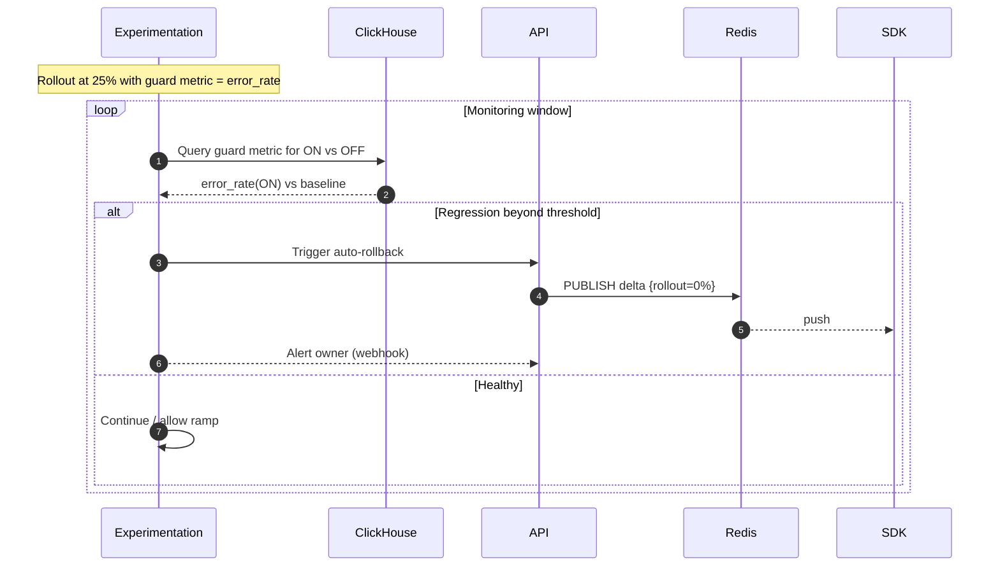
```mermaid
sequenceDiagram
    autonumber
    participant Exp as Experimentation
    participant CH as ClickHouse
    participant API
    participant Redis
    participant SDK

    Note over Exp: Rollout at 25% with guard metric = error_rate
    loop Monitoring window
        Exp->>CH: Query guard metric for ON vs OFF
        CH-->>Exp: error_rate(ON) vs baseline
        alt Regression beyond threshold
            Exp->>API: Trigger auto-rollback
            API->>Redis: PUBLISH delta {rollout=0%}
            Redis-->>SDK: push
            Exp-->>API: Alert owner (webhook)
        else Healthy
            Exp->>Exp: Continue / allow ramp
        end
    end
```

### 7.10 Flag lifecycle — staleness detection & code-reference scan

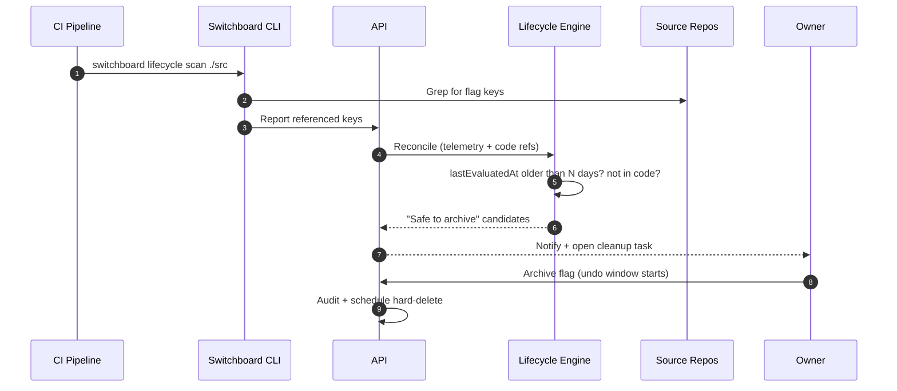
```mermaid
sequenceDiagram
    autonumber
    participant CI as CI Pipeline
    participant CLI as Switchboard CLI
    participant API
    participant Life as Lifecycle Engine
    participant Repo as Source Repos
    participant Owner

    CI->>CLI: switchboard lifecycle scan ./src
    CLI->>Repo: Grep for flag keys
    CLI->>API: Report referenced keys
    API->>Life: Reconcile (telemetry + code refs)
    Life->>Life: lastEvaluatedAt older than N days? not in code?
    Life-->>API: "Safe to archive" candidates
    API-->>Owner: Notify + open cleanup task
    Owner->>API: Archive flag (undo window starts)
    API->>API: Audit + schedule hard-delete
```

### 7.11 GitOps / flags-as-code (anti-lock-in)

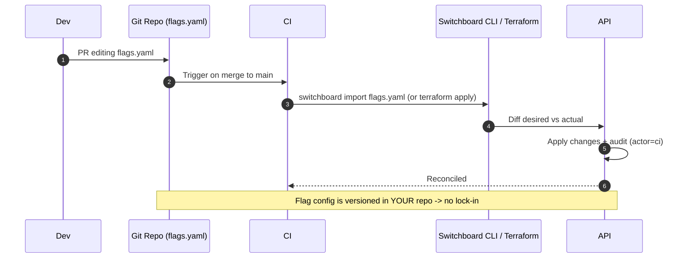
```mermaid
sequenceDiagram
    autonumber
    participant Dev
    participant Git as Git Repo (flags.yaml)
    participant CI
    participant CLI as Switchboard CLI / Terraform
    participant API

    Dev->>Git: PR editing flags.yaml
    Git->>CI: Trigger on merge to main
    CI->>CLI: switchboard import flags.yaml (or terraform apply)
    CLI->>API: Diff desired vs actual
    API->>API: Apply changes + audit (actor=ci)
    API-->>CI: Reconciled
    Note over Git,API: Flag config is versioned in YOUR repo -> no lock-in
```

### 7.12 Export / import (portability)

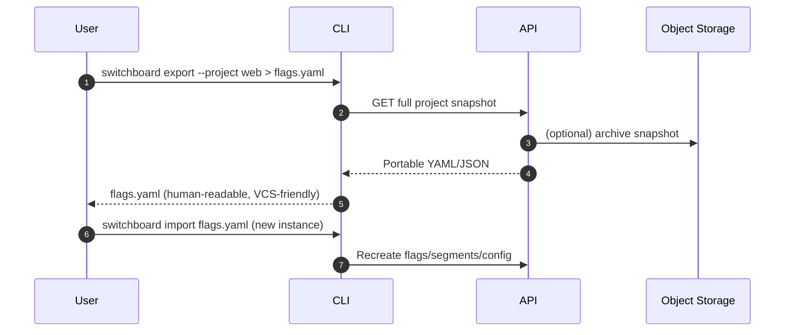
```mermaid
sequenceDiagram
    autonumber
    participant User
    participant CLI
    participant API
    participant Blob as Object Storage

    User->>CLI: switchboard export --project web > flags.yaml
    CLI->>API: GET full project snapshot
    API->>Blob: (optional) archive snapshot
    API-->>CLI: Portable YAML/JSON
    CLI-->>User: flags.yaml (human-readable, VCS-friendly)
    User->>CLI: switchboard import flags.yaml (new instance)
    CLI->>API: Recreate flags/segments/config
```

### 7.13 Offline / degraded operation

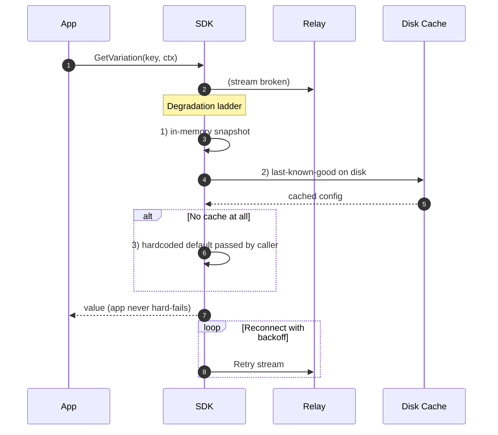
```mermaid
sequenceDiagram
    autonumber
    participant App
    participant SDK
    participant Relay
    participant Cache as Disk Cache

    App->>SDK: GetVariation(key, ctx)
    SDK->>Relay: (stream broken)
    Note over SDK: Degradation ladder
    SDK->>SDK: 1) in-memory snapshot
    SDK->>Cache: 2) last-known-good on disk
    Cache-->>SDK: cached config
    alt No cache at all
        SDK->>SDK: 3) hardcoded default passed by caller
    end
    SDK-->>App: value (app never hard-fails)
    loop Reconnect with backoff
        SDK->>Relay: Retry stream
    end
```

### 7.14 OpenFeature integration (multi-language)

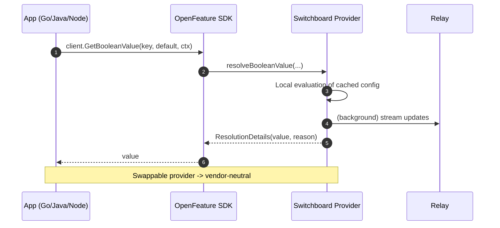
```mermaid
sequenceDiagram
    autonumber
    participant App as App (Go/Java/Node)
    participant OF as OpenFeature SDK
    participant Prov as Switchboard Provider
    participant Relay

    App->>OF: client.GetBooleanValue(key, default, ctx)
    OF->>Prov: resolveBooleanValue(...)
    Prov->>Prov: Local evaluation of cached config
    Prov->>Relay: (background) stream updates
    Prov-->>OF: ResolutionDetails(value, reason)
    OF-->>App: value
    Note over App,Prov: Swappable provider -> vendor-neutral
```

### 7.15 CLI management flow

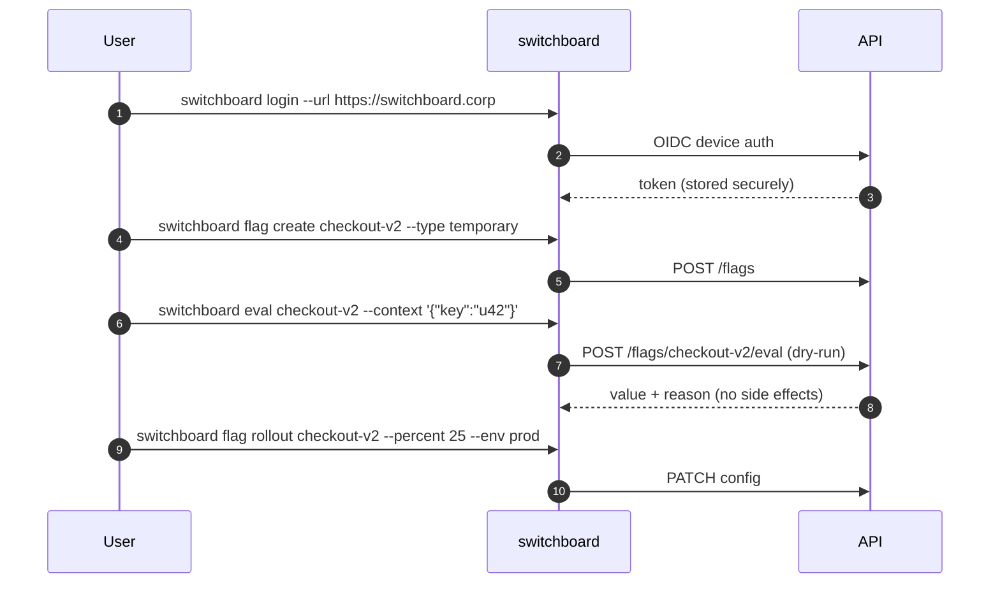
```mermaid
sequenceDiagram
    autonumber
    participant User
    participant CLI as switchboard
    participant API

    User->>CLI: switchboard login --url https://switchboard.corp
    CLI->>API: OIDC device auth
    API-->>CLI: token (stored securely)
    User->>CLI: switchboard flag create checkout-v2 --type temporary
    CLI->>API: POST /flags
    User->>CLI: switchboard eval checkout-v2 --context '{"key":"u42"}'
    CLI->>API: POST /flags/checkout-v2/eval (dry-run)
    API-->>CLI: value + reason (no side effects)
    User->>CLI: switchboard flag rollout checkout-v2 --percent 25 --env prod
    CLI->>API: PATCH config
```

---

## 8. State machines

### 8.1 Flag lifecycle state

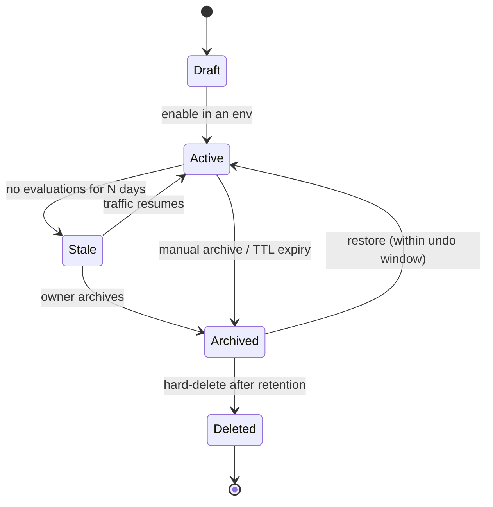
```mermaid
stateDiagram-v2
    [*] --> Draft
    Draft --> Active: enable in an env
    Active --> Stale: no evaluations for N days
    Stale --> Active: traffic resumes
    Stale --> Archived: owner archives
    Active --> Archived: manual archive / TTL expiry
    Archived --> Active: restore (within undo window)
    Archived --> Deleted: hard-delete after retention
    Deleted --> [*]
```

### 8.2 Approval request state

```mermaid
stateDiagram-v2
    [*] --> Pending
    Pending --> Approved: reviewer approves (4-eyes)
    Pending --> Rejected: reviewer rejects
    Pending --> Expired: no action in SLA
    Approved --> Applied: change published
    Rejected --> [*]
    Expired --> [*]
    Applied --> [*]
```

### 8.3 SDK connection state

```mermaid
stateDiagram-v2
    [*] --> Initializing
    Initializing --> Streaming: snapshot + stream OK
    Initializing --> Degraded: relay unreachable, cache used
    Streaming --> Degraded: stream dropped
    Degraded --> Polling: fallback poll succeeds
    Polling --> Streaming: stream restored
    Degraded --> Streaming: reconnect (backoff)
    Streaming --> [*]: Dispose
```

---

## 9. Interfaces

### 9.1 CLI (`switchboard`) — .NET global tool, `System.CommandLine`

```bash
switchboard login --url https://switchboard.mycorp.internal
switchboard flag create checkout-v2 --type temporary --kind bool --owner @parag
switchboard flag on  checkout-v2 --env production
switchboard flag rollout checkout-v2 --env production --percent 25
switchboard eval checkout-v2 --context '{"key":"user-42","plan":"pro"}'   # dry-run
switchboard export --project web > flags.yaml
switchboard import flags.yaml
switchboard lifecycle scan ./src
switchboard lifecycle stale --days 30
```

### 9.2 API surface

- **REST** (OpenAPI) — CRUD for projects/environments/flags/segments/configs; `POST /flags/{key}/eval` dry-run.
- **gRPC** — streaming to SDKs + high-QPS admin ops.
- **GraphQL** (HotChocolate) — composite reads for the Admin UI.
- **Webhooks** — flag change / approval / guard-metric events to Slack, Teams, Jira, PagerDuty.

### 9.3 SDKs

- **.NET SDK** embeds the shared `Switchboard.Evaluation` engine (local eval, no per-flag network call).
- **OpenFeature providers** for Java, Go, Node, Python, Ruby, browser JS, iOS/Android.
- **Client SDKs** use scoped client-side IDs and receive only client-visible flags; secure-mode HMAC of user context.

---

## 10. Non-functional design

| Concern | Approach |
|---------|----------|
| **Latency** | Local in-SDK evaluation; Edge Relay pushes deltas in ms; CDN-cacheable snapshots. |
| **Scalability** | Stateless relay replicas autoscaled on connection count; Redis pub/sub fan-out; control plane scales independently. |
| **Reliability** | Degradation ladder: stream -> poll -> memory -> disk -> caller default. No hard dependency on Switchboard uptime. |
| **Security** | OIDC/SAML SSO, hashed & rotatable SDK keys, RBAC, mTLS internal / TLS external, immutable audit log. |
| **Observability** | OpenTelemetry traces/metrics/logs across control plane, relay, and SDKs. |
| **Consistency** | Postgres transactions + monotonic `version` per FlagConfig; SDKs reconcile by version. |

**Recommended stack:** .NET 8/9, ASP.NET Core (Minimal APIs + gRPC), HotChocolate (GraphQL), System.CommandLine (CLI), PostgreSQL (source of truth), Redis (cache + fan-out), ClickHouse (analytics), Docker + Helm/Kubernetes, OpenFeature (SDK contract), Keycloak/Entra ID (auth).

---

## 11. Deployment topology

```mermaid
flowchart TB
    subgraph Small["Small / Dev"]
        C1["Single container:\nAPI + Relay"]
        PG1[("Postgres")]
        R1[("Redis")]
        C1 --> PG1
        C1 --> R1
    end

    subgraph Prod["Production"]
        LB["Load Balancer"]
        CP["Control Plane x2+"]
        RL["Edge Relay xN (autoscaled)"]
        PGp[("Managed Postgres HA")]
        Rp[("Redis cluster")]
        CHp[("ClickHouse")]
        LB --> CP
        LB --> RL
        CP --> PGp
        CP --> Rp
        RL --> Rp
        CP --> CHp
    end
```

- **Small:** one container + Postgres + Redis via Docker Compose.
- **Production:** control plane (2+) + horizontally scaled Edge Relay near app clusters + managed Postgres HA + Redis cluster + ClickHouse.

---

## 12. Build phases / roadmap

| Phase | Deliverable |
|-------|-------------|
| **P1 — MVP** | Flag CRUD (REST), evaluation engine, .NET SDK (polling), CLI basics, Postgres, boolean flags, on/off + %, audit log. |
| **P2 — Real-time** | Redis fan-out, Edge Relay, SSE/gRPC streaming, SDK cache/offline fallback, segments + targeting rules. |
| **P3 — Governance & DX** | RBAC + SSO, approvals, export/import, Terraform provider, Admin UI, OpenFeature providers (2–3 languages). |
| **P4 — Lifecycle & Experiments** | Flag Lifecycle Engine (staleness + code-ref scan + archival), ClickHouse events, experimentation + guarded rollouts, webhooks/integrations. |

---

*Switchboard keeps LaunchDarkly's full strength set — real-time streaming, advanced targeting, experimentation, governance, reliability, broad SDKs — while structurally neutralizing lock-in, complexity, flag debt, third-party dependency, and learning curve.*
