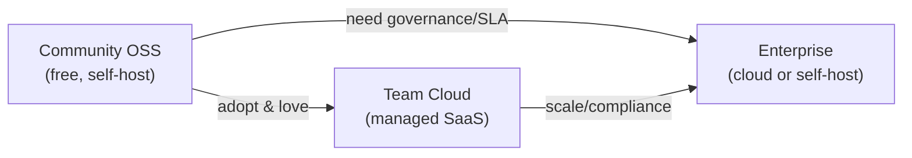
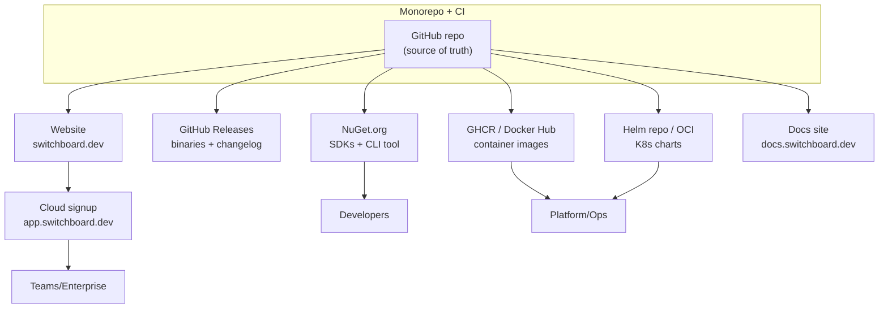
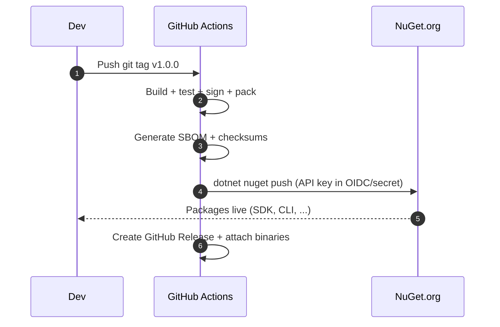
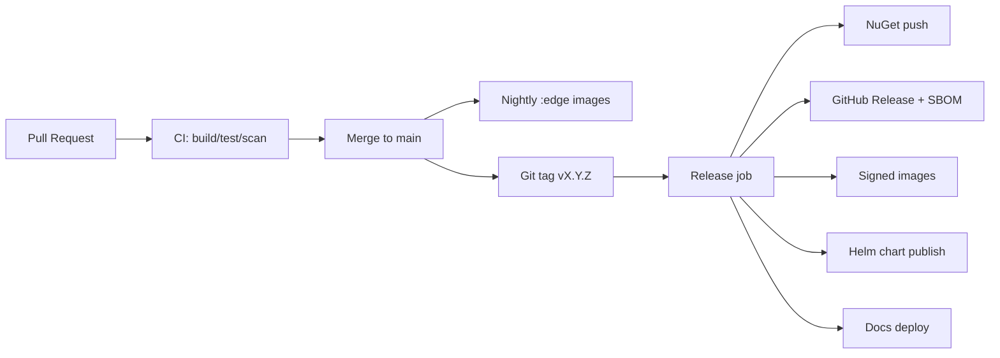
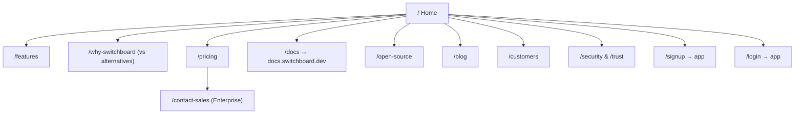
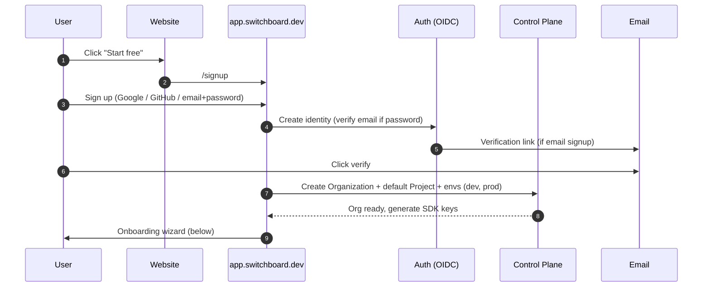
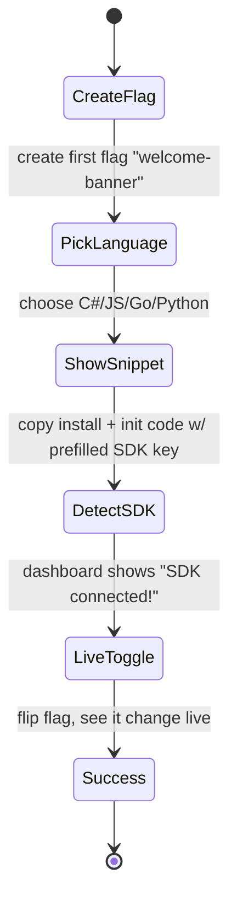
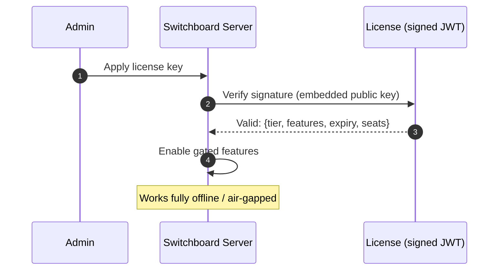
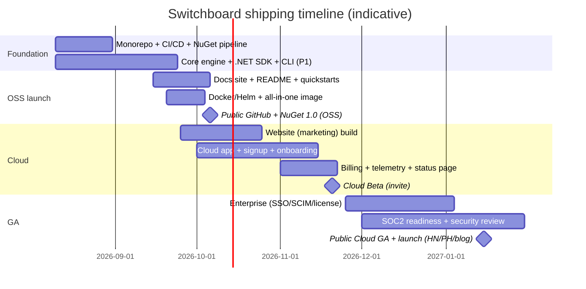

# Switchboard — Go-to-Market & Delivery Plan

**How we ship Switchboard to customers: packaging (NuGet), GitHub/open-source, containers, the website, signup & onboarding, docs, licensing, launch, and support.**

- **Status:** GTM Plan v1.0
- **Date:** 2026-08-05
- **Owner:** [Parag Sawant](https://parags.dev) ([GitHub](https://github.com/paragpsawant))
- **Companion to:** `Switchboard-Feature-Management-Design.md`

---

## Table of contents
1. [Product editions & business model](#1-product-editions--business-model)
2. [Distribution channels overview](#2-distribution-channels-overview)
3. [NuGet packaging & publishing](#3-nuget-packaging--publishing)
4. [GitHub & open-source strategy](#4-github--open-source-strategy)
5. [Container images & Helm](#5-container-images--helm)
6. [Release pipeline & versioning](#6-release-pipeline--versioning)
7. [Website design](#7-website-design)
8. [Signup & onboarding flow](#8-signup--onboarding-flow)
9. [Cloud vs self-hosted provisioning](#9-cloud-vs-self-hosted-provisioning)
10. [Licensing & activation](#10-licensing--activation)
11. [Documentation site](#11-documentation-site)
12. [Telemetry, billing & support](#12-telemetry-billing--support)
13. [Security, legal & compliance to ship](#13-security-legal--compliance-to-ship)
14. [Launch plan & timeline](#14-launch-plan--timeline)
15. [Success metrics](#15-success-metrics)

---

## 1. Product editions & business model

We use an **open-core** model — the engine and SDKs are free and open source; advanced enterprise features and a hosted cloud are commercial. (Cost/pricing amounts are placeholders; adjust later.)

| Edition | Who it's for | Delivery | What's included |
|---------|--------------|----------|-----------------|
| **Community (OSS)** | Individuals, small teams, self-hosters | GitHub + NuGet + Docker (free) | Core engine, all SDKs, CLI, REST/gRPC/streaming, single-project, basic RBAC, audit log, flag lifecycle basics. Apache-2.0. |
| **Team (Cloud)** | Growing teams wanting zero-ops | Hosted SaaS (sign up on website) | Everything in Community + managed hosting, unlimited projects, experimentation, approvals, SSO (Google/GitHub), integrations. |
| **Enterprise** | Larger orgs, regulated | Cloud **or** self-hosted license key | Team + SAML/SCIM, advanced RBAC, guarded rollouts, audit export, priority support, SLA, on-prem/air-gapped. |

**Guiding principle:** the OSS Community edition must be genuinely useful on its own (this drives adoption and trust). Cloud/Enterprise sell *convenience, scale, and governance*, not the core capability.



---

## 2. Distribution channels overview



| Channel | Artifact | Audience |
|---------|----------|----------|
| **NuGet.org** | `.NET` SDK + `dotnet tool` CLI | .NET developers |
| **npm / PyPI / Maven / Go / crates** | Language SDKs (via OpenFeature providers) | Polyglot developers |
| **GitHub Releases** | Server binaries, CLI (win/linux/mac), SBOM, checksums | Self-hosters |
| **GHCR + Docker Hub** | `switchboard/server`, `switchboard/relay`, `switchboard/cli` | Ops / Kubernetes |
| **Helm / OCI registry** | `switchboard` chart | Kubernetes users |
| **Homebrew / winget / Scoop** | CLI convenience installs | CLI users |
| **Website** | Marketing + Cloud signup | Buyers, evaluators |

---

## 3. NuGet packaging & publishing

### 3.1 Package layout
| Package ID | Type | Purpose |
|------------|------|---------|
| `Switchboard.Sdk` | library | Server SDK (.NET) — local evaluation, streaming client. |
| `Switchboard.Sdk.OpenFeature` | library | OpenFeature provider wrapper. |
| `Switchboard.Client` | library | Browser/mobile (Blazor/MAUI) client SDK. |
| `Switchboard.Evaluation` | library | Shared evaluation engine (also a public package for advanced users). |
| `Switchboard.Contracts` | library | DTOs / protobuf-generated models. |
| `Switchboard.Cli` | **dotnet tool** | `dotnet tool install -g Switchboard.Cli` → `switchboard` command. |

### 3.2 Package quality checklist (every package)
- ✅ `PackageId`, `Authors`, `Description`, `PackageProjectUrl`, `RepositoryUrl` set.
- ✅ **`README.md` embedded** (`<PackageReadmeFile>`) — shows on NuGet page.
- ✅ **Icon** (`<PackageIcon>`), **License** (`<PackageLicenseExpression>Apache-2.0`).
- ✅ **Source Link** enabled + **deterministic builds** + **symbol packages** (`.snupkg`).
- ✅ **Signed packages** (author + repository signing).
- ✅ **SemVer** version; multi-target (`net8.0;net9.0;netstandard2.0` for widest reach).
- ✅ SBOM + provenance (SLSA) attached.

### 3.3 Sample `.csproj` metadata
```xml
<PropertyGroup>
  <PackageId>Switchboard.Sdk</PackageId>
  <Version>1.0.0</Version>
  <Authors>Switchboard</Authors>
  <Description>Local-evaluation feature flag SDK for .NET. Real-time, offline-capable, OpenFeature-compatible.</Description>
  <PackageProjectUrl>https://switchboard.dev</PackageProjectUrl>
  <RepositoryUrl>https://github.com/switchboard-io/switchboard</RepositoryUrl>
  <PackageLicenseExpression>Apache-2.0</PackageLicenseExpression>
  <PackageReadmeFile>README.md</PackageReadmeFile>
  <PackageIcon>icon.png</PackageIcon>
  <PublishRepositoryUrl>true</PublishRepositoryUrl>
  <EmbedUntrackedSources>true</EmbedUntrackedSources>
  <IncludeSymbols>true</IncludeSymbols>
  <SymbolPackageFormat>snupkg</SymbolPackageFormat>
  <Deterministic>true</Deterministic>
  <ContinuousIntegrationBuild>true</ContinuousIntegrationBuild>
</PropertyGroup>
```

### 3.4 Publishing flow


- Publish is **tag-driven and automated** (no manual pushes).
- **Prerelease** channel: `1.1.0-preview.1` for early adopters.
- First-run experience: `dotnet add package Switchboard.Sdk` → 5-line quickstart in README.

### 3.5 Multi-language SDK packages (polyglot)

The bare name `switchboard` is already taken on npm, PyPI, RubyGems, and crates.io, so we standardize on a **`switchboard-sdk`** suffix (and the **`@switchboard`** scope on npm). Every ecosystem ships an **SDK** and an **OpenFeature provider**.

| Language | Registry | SDK package | OpenFeature provider | Name status |
|----------|----------|-------------|----------------------|-------------|
| .NET | NuGet | `Switchboard.Sdk` | `Switchboard.OpenFeature` | ✅ available |
| JavaScript/TS | npm | `@switchboard/sdk` | `@switchboard/openfeature-provider` | scope (needs npm org) |
| Python | PyPI | `switchboard-sdk` | `switchboard-openfeature-provider` | ✅ available |
| Go | Go modules | `github.com/switchboard-io/switchboard-go` | `.../openfeature` subpackage | ✅ available |
| Java | Maven Central | `io.github.switchboard-io:sdk` | `io.github.switchboard-io:openfeature-provider` | ✅ (via OSSRH) |
| Ruby | RubyGems | `switchboard-sdk` | `switchboard-openfeature` | ✅ available |
| Rust | crates.io | `switchboard-sdk` | `switchboard-openfeature` | verify (bare taken) |

**Repo layout** — all stubs live under `sdk/` in the monorepo:
```
sdk/
├─ js/        (@switchboard/sdk — package.json + index.js/.d.ts)
├─ python/    (switchboard-sdk — pyproject.toml + switchboard_sdk/)
├─ go/        (switchboard-go — go.mod + switchboard.go)
├─ java/      (io.github.switchboard-io:sdk — pom.xml)
├─ ruby/      (switchboard-sdk — gemspec + lib/)
└─ rust/      (switchboard-sdk — Cargo.toml + src/lib.rs)
```

**Publish commands per registry (name reservation):**
```bash
# npm      (requires @switchboard org)
cd sdk/js && npm publish --access public
# PyPI
cd sdk/python && python -m build && twine upload dist/*
# Go       (reserve by tagging the repo; module path = github path)
git tag sdk/go/v0.0.1 && git push --tags
# Java     (Sonatype OSSRH -> Maven Central; requires namespace verification)
cd sdk/java && mvn deploy
# Ruby
cd sdk/ruby && gem build switchboard-sdk.gemspec && gem push switchboard-sdk-0.0.1.gem
# Rust
cd sdk/rust && cargo publish
```

**Notes / prerequisites:**
- **npm** `@switchboard` scope requires creating the **npm organization `switchboard`** (else fall back to unscoped `switchboard-sdk`).
- **Java/Maven Central** requires **namespace verification** via Sonatype Central — `io.github.switchboard-io` is verifiable by proving ownership of the GitHub org (no domain needed); `co.switchboard` needs DNS proof on `switchboard.co`.
- **Go** has no central registry — the module path *is* the GitHub repo (`switchboard-io/switchboard-go`); "publishing" = tagging a release.
- Each stub is a **compilable/importable placeholder** (verified: Node import ✅, Python import ✅, Rust build ✅) so `0.0.1` can be published to lock the name.

---

## 4. GitHub & open-source strategy

### 4.1 Org & repos
- **Org:** `github.com/switchboard-io`
- **Repos:**
  - `switchboard` — monorepo (server, relay, engine, CLI, .NET SDK, Admin UI).
  - `switchboard-docs` — docs site (or `/docs` in monorepo).
  - `openfeature-provider-*` — per-language providers (go/java/node/python) if not vendored.
  - `helm-charts`, `terraform-provider-switchboard`, `examples`.

### 4.2 Repo essentials (trust signals)
- `README.md` — hero, 60-second quickstart, badges (build, NuGet, license, Discord).
- `LICENSE` (Apache-2.0), `NOTICE`.
- `CONTRIBUTING.md`, `CODE_OF_CONDUCT.md`, `SECURITY.md` (disclosure policy + `security@`).
- `.github/` — issue/PR templates, `CODEOWNERS`, Dependabot, workflows.
- `CHANGELOG.md` (Keep a Changelog) + Releases with notes.
- `ROADMAP.md`, `ARCHITECTURE.md` (link the design doc), `ADR/` decision records.
- **Discussions** enabled; **Discord/Slack** community link.

### 4.3 Open-core boundary
- OSS repo = Community edition (Apache-2.0).
- Enterprise-only features behind a separate private module / license-gated build (`Switchboard.Enterprise`), clearly documented so the OSS boundary is transparent.

### 4.4 CI on GitHub Actions
- **PR checks:** build, unit + integration tests, linters/format, CodeQL (SAST), dependency scan, license check.
- **Main:** nightly builds, container image publish (`:edge`).
- **Tag:** full release (NuGet + GH Release + images + Helm + docs deploy).

---

## 5. Container images & Helm

### 5.1 Images (GHCR + Docker Hub mirror)
| Image | Contents |
|-------|----------|
| `ghcr.io/switchboard-io/server` | Control plane (API + GraphQL). |
| `ghcr.io/switchboard-io/relay` | Edge relay (streaming data plane). |
| `ghcr.io/switchboard-io/cli` | CLI for CI use. |
| `ghcr.io/switchboard-io/all-in-one` | Single-container demo (server+relay+embedded db). |

- Multi-arch (`linux/amd64`, `linux/arm64`), distroless base, non-root, healthchecks, image signing (cosign), SBOM attached.

### 5.2 Quickstarts
```bash
# 60-second local trial
docker run -p 8080:8080 ghcr.io/switchboard-io/all-in-one:latest
# then: open http://localhost:8080 (Admin UI)
```
```bash
# Production on Kubernetes
helm repo add switchboard https://charts.switchboard.dev
helm install sb switchboard/switchboard -f values.yaml
```
- Also ship a **`docker-compose.yml`** (server + relay + postgres + redis) for small deployments.

---

## 6. Release pipeline & versioning



- **SemVer** across all artifacts; server, CLI, SDK versioned independently but coordinated.
- **Support policy:** latest minor + previous minor get patches; LTS line every ~12 months.
- **Release cadence:** minor every 6–8 weeks; patches as needed; security fixes out-of-band.

---

## 7. Website design

### 7.1 Domains
- **Marketing:** `switchboard.dev`
- **App (Cloud):** `app.switchboard.dev`
- **Docs:** `docs.switchboard.dev`
- **Status:** `status.switchboard.dev`
- **API (cloud):** `api.switchboard.dev`

### 7.2 Tech stack
- **Marketing site:** Astro or Next.js (static-first, fast, SEO). Hosted on Vercel/Cloudflare Pages/Azure Static Web Apps.
- **App (Cloud console):** Blazor WebAssembly or React SPA talking to the control-plane API (dogfoods our own product).
- **Docs:** Docusaurus / Astro Starlight / MkDocs Material.
- **Design system:** shared tokens/components across marketing + app + docs for one brand.

### 7.3 Sitemap (marketing)


### 7.4 Home page sections (top to bottom)
1. **Hero** — headline ("Ship features. Stay in control."), subhead, primary CTA **Start free** + secondary **Self-host on GitHub**. Live product screenshot/animation.
2. **Social proof** — logos, GitHub stars, NuGet downloads counter.
3. **Core value props** (3–4 cards): Real-time flags · Advanced targeting · Experimentation · Kill switches.
4. **The differentiators** (our con→pro story): No lock-in (OpenFeature/export) · No flag debt (lifecycle) · Works offline · Open source.
5. **Interactive demo / code tabs** — copy-paste quickstart in C#, JS, Go, Python.
6. **Architecture at a glance** — self-host or cloud diagram.
7. **Comparison table** — vs LaunchDarkly / vs OSS alternatives (honest, feature-based).
8. **Pricing teaser** → link to /pricing.
9. **Security & trust** — SOC2 (roadmap), self-host, audit logs.
10. **CTA band** — Start free / Talk to us.
11. **Footer** — docs, GitHub, Discord, status, legal, social.

### 7.5 Key pages
- **/features** — deep dives with screenshots per capability.
- **/why-switchboard** — the migration/anti-lock-in narrative + import-from-LaunchDarkly guide.
- **/pricing** — 3 tiers (Community free, Team, Enterprise) + FAQ + "self-host is always free."
- **/open-source** — license, repo links, contribution guide, roadmap, community.
- **/security** & **/trust** — data handling, self-host option, compliance status, subprocessors.
- **/docs** — redirect to docs site.
- **/blog** — launch posts, engineering, changelog highlights.

---

## 8. Signup & onboarding flow

### 8.1 Cloud signup (self-serve, no credit card for free/trial)


### 8.2 Onboarding wizard (time-to-first-flag < 5 min)


**Wizard steps in detail:**
1. **Create your first flag** — one field (name), boolean, defaults to OFF. (Simple Mode.)
2. **Choose your language** — tabs; we show exact `dotnet add package Switchboard.Sdk` + init code with the **SDK key pre-filled**.
3. **Connection check** — live banner: "Waiting for your app…" → turns green when the SDK first calls in (uses evaluation telemetry).
4. **Flip it live** — user toggles the flag in the dashboard and watches the reason/value update — the "aha" moment.
5. **Next steps** — invite teammates, add targeting rules, connect Slack, read docs.

### 8.3 Self-hosted onboarding (no signup required)
```mermaid
sequenceDiagram
    autonumber
    participant U as User
    participant Docker
    participant Admin as Admin UI
    U->>Docker: docker run ... all-in-one
    Docker->>Admin: First-run setup at localhost:8080
    U->>Admin: Create admin account (local)
    Admin->>Admin: Seed default project + envs + demo flag
    Admin-->>U: Copy SDK key, follow quickstart
    Note over U,Admin: Zero external dependency; fully offline-capable
```

### 8.4 Team invitations & roles
- Invite by email → role picker (Owner/Admin/Maintainer/Developer/Viewer).
- SSO auto-provisioning (SCIM) for Enterprise.
- Per-project + per-environment scoping.

---

## 9. Cloud vs self-hosted provisioning

| Aspect | Cloud (SaaS) | Self-hosted |
|--------|--------------|-------------|
| **Signup** | Website → app, instant org | Run container, first-run wizard |
| **Hosting** | We run control plane + relay | Customer's infra (K8s/VM/Compose) |
| **Auth** | Google/GitHub/email; SAML (Ent) | Local admin + OIDC/SAML config |
| **Updates** | Automatic | Customer upgrades images/Helm |
| **Data residency** | Our regions | Fully customer-controlled |
| **Billing** | Metered (MAU/seats) | License key (Enterprise) or free (Community) |

**Cloud tenancy:** pooled multi-tenant by default (row-level isolation on `orgId`); dedicated single-tenant option for Enterprise.

---

## 10. Licensing & activation

- **Community:** Apache-2.0, no key required.
- **Enterprise (self-host):** signed **offline license key** (JWT with public-key verification) unlocking gated features; supports air-gapped (no phone-home required).
- **Cloud:** entitlements enforced server-side by plan.



---

## 11. Documentation site

**IA (docs.switchboard.dev):**
- **Get started** — Cloud quickstart, Self-host quickstart, first flag in 5 min.
- **Concepts** — flags, environments, segments, targeting, rollouts, experiments, lifecycle.
- **SDKs** — one page per language (install, init, evaluate, events, offline).
- **CLI reference** — every `switchboard` command (auto-generated from `System.CommandLine`).
- **API reference** — OpenAPI-rendered REST + gRPC + GraphQL schema.
- **Guides** — progressive rollout, kill switch, A/B test, approvals, GitOps, migrate-from-LaunchDarkly.
- **Self-hosting** — Docker/Compose/Helm, scaling the relay, backups, upgrades, HA.
- **Security** — auth, RBAC, secure mode, audit, data model.
- **Changelog** & **Roadmap**.

**Quality:** copy-paste-tested snippets, dark mode, search (Algolia), versioned docs, "edit on GitHub."

---

## 12. Telemetry, billing & support

### 12.1 Product telemetry (privacy-first)
- **Opt-in / clearly disclosed**; self-host defaults conservative. No flag *values* or user PII leave the customer.
- Usage metrics for us: install counts, feature adoption, error rates (aggregate).
- Powers **flag staleness** for the customer (their own data, stays in their instance for self-host).

### 12.2 Billing (Cloud)
- Metered on **MAU (monthly active contexts)** + seats; Stripe integration; in-app usage dashboard; invoices; upgrade/downgrade self-serve.

### 12.3 Support tiers
| Tier | Channel | SLA |
|------|---------|-----|
| Community | GitHub Issues, Discord | best-effort |
| Team | Email support | next business day |
| Enterprise | Priority + Slack Connect + named contact | contractual SLA |

- **Status page** (status.switchboard.dev) with incident history + subscribe.

---

## 13. Security, legal & compliance to ship

- **SECURITY.md** + responsible disclosure + `security@switchboard.dev`; bug-bounty later.
- **Supply chain:** signed packages/images, SBOM, SLSA provenance, Dependabot, CodeQL.
- **Legal pages:** Terms of Service, Privacy Policy, DPA, Subprocessors list, Acceptable Use, Cookie policy.
- **Compliance roadmap:** SOC 2 Type II (target), GDPR readiness, data residency options.
- **Trademark:** register "Switchboard" word mark in the software class (double-check clearance with counsel — the word is common; a distinctive logo + wordmark helps).
- **Accessibility:** WCAG 2.1 AA for app + marketing.

---

## 14. Launch plan & timeline



### 14.1 Launch sequence
1. **Private alpha** — dogfood internally + a few design partners (self-host).
2. **OSS launch** — public GitHub + NuGet 1.0 + docs. Post to Hacker News, Reddit r/dotnet, dev.to, OpenFeature community.
3. **Cloud beta** — invite waitlist from website; gather feedback; refine onboarding funnel.
4. **GA** — Product Hunt + Hacker News "Show HN" + launch blog + comparison content + conference talks.

### 14.2 Launch-day assets
- Landing page live, "Start free" working, docs complete, 3+ SDK quickstarts tested, demo video, launch blog, comparison page, migration guide from LaunchDarkly, press kit (logos), Discord open.

---

## 15. Success metrics

| Funnel stage | Metric | Early target |
|--------------|--------|--------------|
| Awareness | GitHub stars, website visits, NuGet downloads | stars > 1k in 90 days |
| Activation (OSS) | Self-host installs that reach "first flag evaluated" | > 40% of installs |
| Activation (Cloud) | Signups reaching "SDK connected + flag flipped" | > 50% in < 10 min |
| Retention | Weekly active orgs, flags evaluated/week | steady WoW growth |
| Conversion | Free → Team upgrade rate | > 3% |
| Community | Discord members, contributors, docs feedback | active weekly |

---

*This plan takes Switchboard from source code to customers: automated NuGet/GitHub/container releases, a fast marketing site, a < 5-minute self-serve signup, a friction-free self-host path, honest open-core licensing, and a staged OSS-first launch that builds trust before monetizing convenience.*
